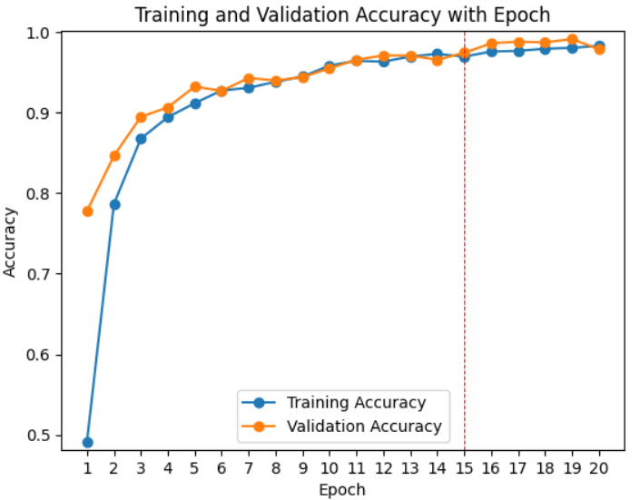
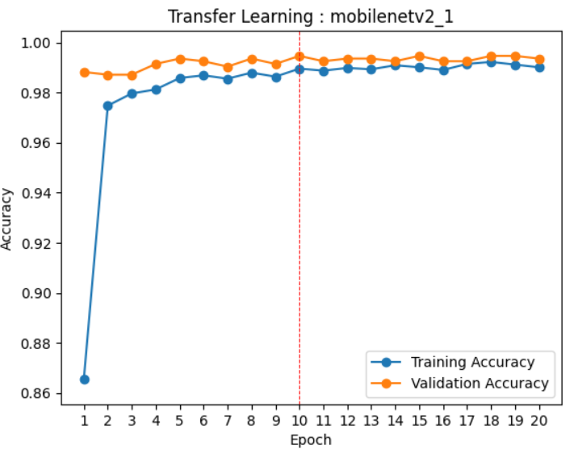

# Handwritten Digit Recognition with TensorFlow

<b><a href="https://github.com/Sanaullah-nahk/Dice_Analytics_Deep_Learning/blob/main/Assignment_2.ipynb" target="_blank">Click here to review the main Jupyter notebook file for this repository.</a></b>

## Task 1: Data Preparation and Training

In this initial phase, our dataset is partitionally divided with 80% for training and the remaining 20% for validation. This structure ensures that our model learns effectively and generalizes well to new data.

I utilize a dynamic data augmentation strategy that includes rotations, zooming, translations, and contrast adjustments. This technique enriches our dataset, reflecting a wide variety of handwriting styles. The process of augmentation was a learning curve, especially understanding its probabilistic nature. When applied a random zoom of 20%, it means each image in the dataset has a chance of being zoomed but isn't guaranteed. This randomization ensures that our model rarely sees the exact same picture twice, enhancing its ability to generalize.

After 20 epochs, our custom-built model reached a satisfactory level of accuracy. However, the sweet spot for our training seems to be around the 12-epoch mark, where the model's validation accuracy starts to plateau, suggesting that it has learned as much as it can without beginning to overfit.

## Task 2: Fine-tuning a Pre-trained Model

This task is all about adapting and retraining the MobileNetV2 model, a pre-trained powerhouse, for our specific digit recognition task. Images are first resized and rescaled to fit the model's expected input shape. This step is crucial because pre-trained models like MobileNetV2 are trained on specific input sizes, and matching these dimensions is imperative for effective transfer learning.

Our fine-tuned "DigitDoodleNet" model shows promising results, achieving high accuracy with minimal overfitting, as depicted in the accuracy plot below.

## Task 3: Image Retrieval with Pre-trained Models

To extend the application of pre-trained models by using a ResNet model for feature extraction. These features enable us to develop a function to retrieve similar images from a local database, based on a query image. The system displays the query alongside the top four most similar images, making it user-friendly and practical for real-world applications.

## Easy-to-Use Image Retrieval

You can easily retrieve similar images by providing the filename from the query image folder.

## Challenges Faced

In this assignment, data augmentation posed a significant learning opportunity. The concept of randomly transforming images to prevent overfitting and the realization that our model might not see the original image at all during training were enlightening.

Resizing images for pre-trained models was another hurdle. Ensuring that our dataset conformed to the input requirements of models trained on ImageNet, like MobileNetV2, was essential for effective learning and accuracy.
